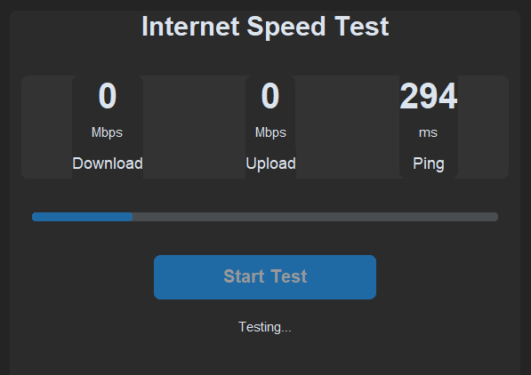

# Internet Speed Tester / مختبر سرعة الإنترنت

<div dir="ltr">

## English 🇬🇧

A modern, beautiful, and accurate internet speed testing application built with Python.



### Features 

- **Modern UI**: Built with CustomTkinter for a sleek, modern look
- **Accurate Measurements**: 
  - Download Speed Testing
  - Upload Speed Testing
  - Ping Measurement
  - Real servers testing (Cloudflare, Hetzner, OVH)
- **Real-time Progress**: Visual feedback during testing
- **History Tracking**: Keep track of your previous speed tests
- **Dark Mode**: Modern dark theme for better visibility
- **Responsive Design**: Resizable window that adapts to your screen

### Requirements 

- Python 3.8 or higher
- Required packages:
  ```
  customtkinter==5.2.0
  pillow==10.0.0
  requests==2.31.0
  ```

### Installation 

1. Clone the repository:
```bash
git clone https://github.com/Al-shwaib/Internet-Speed-Tester.git
cd internet-speed-tester
```

2. Install requirements:
```bash
pip install -r requirements.txt
```

### Usage 

Run the application:
```bash
python main.py
```

## How It Works 

1. **Download Speed**: Tests download speed using multiple servers for accuracy
2. **Upload Speed**: Measures upload speed using reliable test endpoints
3. **Ping**: Calculates response time to various servers
4. **History**: Automatically saves test results for future reference

## Screenshots 

[Add screenshots of your application here]

## Contributing 

Feel free to contribute to this project:
1. Fork the repository
2. Create a new branch
3. Make your changes
4. Submit a pull request

## License 

This project is licensed under the MIT License - see the LICENSE file for details.

## Acknowledgments 

- CustomTkinter for the modern UI components
- Speed test servers (Cloudflare, Hetzner, OVH) for providing test endpoints

</div>

<div dir="rtl" lang="ar">

## العربية 🇸🇦

تطبيق عصري وجميل ودقيق لاختبار سرعة الإنترنت مبني باستخدام بايثون.


### المميزات

- **واجهة مستخدم عصرية**: مبنية باستخدام CustomTkinter لمظهر أنيق وعصري
- **قياسات دقيقة**:
  - اختبار سرعة التنزيل
  - اختبار سرعة الرفع
  - قياس وقت الاستجابة (Ping)
  - اختبار الخوادم الحقيقية (Cloudflare, Hetzner, OVH)
- **تقدم فوري**: تغذية راجعة مرئية أثناء الاختبار
- **تتبع السجل**: تتبع اختبارات السرعة السابقة
- **الوضع المظلم**: مظهر مظلم عصري لرؤية أفضل
- **تصميم متجاوب**: نافذة قابلة لإعادة التحجيم تتكيف مع شاشتك

### المتطلبات

- بايثون 3.8 أو أعلى
- الحزم المطلوبة:
  ```
  customtkinter==5.2.0
  pillow==10.0.0
  requests==2.31.0
  ```

### التثبيت

1. استنساخ المستودع:
```bash
git clone https://github.com/Al-shwaib/Internet-Speed-Tester.git
cd internet-speed-tester
```

2. تثبيت المتطلبات:
```bash
pip install -r requirements.txt
```

### الاستخدام

تشغيل التطبيق:
```bash
python main.py
```

## كيف يعمل 

1. **سرعة التنزيل**: يختبر سرعة التنزيل باستخدام خوادم متعددة من أجل الدقة
2. **سرعة الرفع**: يقيس سرعة الرفع باستخدام نقاط اختبار موثوقة
3. **وقت الاستجابة**: يحسب وقت الاستجابة لخوادم مختلفة
4. **السجل**: يحفظ نتائج الاختبار تلقائيًا للمراجعة في المستقبل

## لقطات الشاشة 

[أضف لقطات شاشة لتطبيقك هنا]

## المساهمة 

شجع على المساهمة في هذا المشروع:
1. انشئ نسخة من المستودع
2. أنشئ فرعًا جديدًا
3. قم بتعديلاتك
4. أرسل طلب سحب

## رخصة 

يخضع هذا المشروع لرخصة MIT - انظر ملف LICENSE لمزيد من التفاصيل.

## إعترافات 

- CustomTkinter لمكونات واجهة المستخدم الحديثة
- خوادم اختبار السرعة (Cloudflare, Hetzner, OVH) لتوفير نقاط اختبار

</div>
